## The Network Transport Framework: Core Libraries

The Network Transport Framework (NTF) is an open-source collection of libraries
for asynchronous network programming for scalable, high-performance
applications.  This repository contains libraries providing the core APIs
for asynchronous sockets, timers, resolvers, reactors, proactors, and thread
pools.

In general, NTF provides building blocks and higher-level abstractions for
asynchronously sending and receiving data between processes. More specifically,
NTF provides an abstraction around the differences in the native networking
APIs offered by the supported operating system, and introduces many useful
features commonly required by networked applications. The principle feature
of the sockets of this library is the introduction of *virtual* *send* *and*
*receive* *queues*, which provide a message-oriented, thread-safe (concurrent),
send and receive API for sockets using transports with either datagram
semantics or stream semantics. Additionally, these virtual queues allow users
to operate sockets both reactively (i.e. in the Unix readiness model) or
proactively (i.e. in the Windows I/O completion model), regardless of the
operating system and interface to that operating system (e.g. *select*,
*kqueue*, *epoll*, *io_uring*, *I/O completion ports* etc.) NTF supports both
stream sockets using TCP and datagram sockets using UDP communicating over
either IPv4 or IPv6 networks. NTF also supports local (aka Unix) domain
sockets for efficiently communicating between processes on the same machine.

The mechanisms in NTF are scalable, efficient, and multi-threaded. Its
libraries are intended for applications needing to manage anywhere from
a single socket to many thousands of simultaneous sockets.

#### Table of Contents

- [Architecture](#architecture)
- [Features](#features)
- [Quick Start](#quick-start)
- [System Requirements](#system-requirements)
- [Build Instructions](#build-instructions)
- [Contributing](#contributing)
- [License](#license)
- [Code of Conduct](#code-of-conduct)
- [More Information](#more-information)

---

### Architecture

The Network Transport Framework designs its core API around the following
concepts.

- [Datagram Socket](groups/ntc/ntci/ntci_datagramsocket.h)
  <p>
  A connection-less, unreliable, unicasting or multicasting socket with unordered message semantics sending and receiving data.
  </p>
- [Stream Socket](groups/ntc/ntci/ntci_streamsocket.h)
  <p>
  A connection-oriented, reliable, unicasting socket with stream semantics sending and receiving data.
  </p>
- [Listener Socket](groups/ntc/ntci/ntci_listenersocket.h)
  <p>
  An acceptor of stream socket connections.
  </p>
- [Timer](groups/ntc/ntci/ntci_timer.h)
  <p>
  Schedule and reschedule a function to execute at a point in time, and to potentially recur.
  </p>
- [Strand](groups/ntc/ntci/ntci_strand.h)
  <p>
  Guarantee the sequential, non-concurrent execution of a series of functions.
  </p>
- [Reactor](groups/ntc/ntci/ntci_reactor.h)
  <p>
  Asynchronous I/O events in the "Unix" readiness paradigm. Available on all platforms.
  </p>
- [Proactor](groups/ntc/ntci/ntci_proactor.h)
  <p>
  Asynchronous socket I/O and timers in the "Windows" completion paradigm. Available on Darwin, Linux, and Windows.
  </p>
- [Driver](groups/ntc/ntci/ntci_driver.h)
  <p>
  A socket and timer factory where I/O and timers are driven manually by a user thread (e.g., the main program thread), at the user's discretion.  The user thread drives an internally managed reactor or proactor, the implementation (e.g., epoll, kqueue, I/O completion ports) of which is configurable at runtime.
  </p>
- [Thread](groups/ntc/ntci/ntci_thread.h)
  <p>
  A single thread, acting as a socket and timer factory, running in the background that automatically manages the detection and completion of socket I/O events and timers. The thread drives an internally managed reactor or proactor, of the implementation (e.g., epoll, kqueue, I/O completion ports, etc.) of which is configurable at runtime.
  </p>
- [Interface](groups/ntc/ntci/ntci_interface.h)
  <p>
  A group of threads, collectively acting as a socket and timer factory, over which sockets and timers are statically or dynamically load balanced according to configurable and programmable criteria. Each thread is run in the background and automatically manages the detection and completion of socket I/O operations, events, and timers. Threads in the thread pool drive internally managed reactors or proactors, the implementation (e.g., epoll, kqueue, I/O completion ports, etc.) of which are configurable at run-time.
  </p>

<center></center>

<sub><sup>
Jump to
[Table of Contents](#table-of-contents) |
[Architecture](#architecture) |
[Features](#features) |
[Quick Start](#quick-start) |
[System Requirements](#system-requirements) |
[Build Instructions](#build-instructions)
</sup></sub>

---

### Features

The Network Transport Framework supports a wide variety of features across the
two core libraries.

#### Network Transport System (NTS)

- Rich set of networking vocabulary types including addresses, endpoints, and errors
- Basic blocking and non-blocking, object-oriented, unicasting or multicasting datagram sockets using either UDP over IPv4/IPv6 or in the local (aka Unix) domain
- Basic blocking and non-blocking, object-oriented, unicasting stream sockets using either TCP over IPv4/IPv6 or in the local (aka Unix) domain
- Blocking hostname to address resolution and address to hostname reverse resolution
- Blocking service name to port number resolution and port number to service name reverse resolution

#### Network Transport Core (NTC)

- Asynchronous datagram and stream sockets using callbacks (in the proactive "Windows" style) or events (in the reactive "Unix" style)
- Run-time selectable drivers: select, poll, epoll (on Linux), pollset (on AIX), event ports and /dev/poll (on Solaris), kqueue (on FreeBSD/Darwin), and I/O completion ports (on Windows)
- Asynchronous hostname to address resolution and address to hostname reverse resolution
- Asynchronous service name to port number resolution and port number to service name reverse resolution
- Asynchronous, high-precision one-shot or periodic timers
- Strand semantics: serializability of a sequence of operations executed on multiple threads
- Integrated TLS: any stream socket can be arbitrarily upgraded into a TLS session and then downgraded back into a raw transport
- Static load balancing: I/O for a particular socket is always performed by the same I/O thread; fast and efficient but subject to "head of line blocking" situations where I/O for one thread may starve the process from processing available I/O for other sockets assigned to the same I/O thread
- Dynamic load balancing: I/O for a particular socket may be performed by any I/O thread; slower and less efficient but avoids "head of line blocking" situations, where I/O for one thread will not starve the process from processing available I/O for other sockets
- Read operation queuing: multiple read operations can be simultaneously queued from multiple threads
- Automatic and manual read flow control to apply back pressure to remote senders
- Read rate limiting: Limit the rate at which data is copied from socket receive buffers, using a policy that may be potentially shared and enforced across multiple sockets
- Read cancellation: Cancel a read operation that has not yet been satisfied
- Read expiration: Assign a deadline before which a read operation must be satisfied
- Write operation queueing: multiple write operations can be simultaneously queued from multiple threads
- Write atomicity: Write operations are guaranteed to be entirely transmitted as a logical sequence, without the need to handle partial writes
- Automatic and manual write flow control to cooperate with back pressure applied by remote receivers
- Write rate limiting: Limit the rate at which data is copied to a socket send buffer, using a policy that may be potentially shared and enforced across multiple sockets
- Write expiration: Assign a deadline before which a blob must be started to be copied to a socket send buffer, otherwise the write fails and is discarded.
- Write cancellation: Cancel a write operation provided it has not yet been started to be copied to a socket send buffer
- Write callbacks: Notify the user when data to be sent is fully copied to a socket send buffer; useful for senders that represent the data to be sent using something like a raw pointer to the buffer and a length, to manage the lifetime of that data
- Write data representation variability: Data to be sent may be represented as a raw pointer and a length, or an array of (non-data owning) buffers, or blobs, or blob  buffers
- Efficient transmission of data stored in a file on the local filesystem, without copying that data into userspace. [on Linux and Solaris only]

<sub><sup>
Jump to
[Table of Contents](#table-of-contents) |
[Architecture](#architecture) |
[Features](#features) |
[Quick Start](#quick-start) |
[System Requirements](#system-requirements) |
[Build Instructions](#build-instructions)
</sup></sub>

---

### Quick Start

The following code illustrates the general look and feel of the NTF core API.
This example shows how to create an asynchronous listener socket to accept
a connection, an asynchronous client socket that connects to that listener
socket, and an asynchronous server socket accepted by the listener that is the
peer of the client socket. The sockets are asynchronously driven by a pool of
I/O threads.
```c++
    // Initialize the library.

    ntcf::SystemGuard systemGuard(ntscfg::Signal::e_PIPE);

    ntsa::Error      error;
    bslmt::Semaphore semaphore;

    // Create and start a pool of I/O threads.

    ntca::InterfaceConfig interfaceConfig;
    interfaceConfig.setThreadName("example");

    bsl::shared_ptr<ntci::Interface> interface =
                               ntcf::System::createInterface(interfaceConfig);

    error = interface->start();
    BSLS_ASSERT(!error);

    // Create a listener socket and begin listening.

    ntca::ListenerSocketOptions listenerSocketOptions;
    listenerSocketOptions.setTransport(ntsa::Transport::e_TCP_IPV4_STREAM);
    listenerSocketOptions.setSourceEndpoint(
                          ntsa::Endpoint(ntsa::Ipv4Address::loopback(), 0));

    bsl::shared_ptr<ntci::ListenerSocket> listenerSocket =
                    interface->createListenerSocket(listenerSocketOptions);

    error = listenerSocket->open();
    BSLS_ASSERT(!error);

    error = listenerSocket->listen();
    BSLS_ASSERT(!error);

    // Connect a socket to the listener.

    ntca::StreamSocketOptions streamSocketOptions;
    streamSocketOptions.setTransport(ntsa::Transport::e_TCP_IPV4_STREAM);

    bsl::shared_ptr<ntci::StreamSocket> clientSocket =
                          interface->createStreamSocket(streamSocketOptions);

    ntca::ConnectOptions connectOptions;

    ntci::ConnectCallback connectCallback =
        clientSocket->createConnectCallback(
            [&](const bsl::shared_ptr<ntci::Connect>& connector,
                const ntca::ConnectEvent&             event)
    {
        BSLS_ASSERT(!event.context().error());
        semaphore.post();
    });

    error = clientSocket->connect(listenerSocket->sourceEndpoint(),
                                  connectOptions,
                                  connectCallback);
    BSLS_ASSERT(!error);

    semaphore.wait();

    // Accept a connection from the listener socket's backlog.

    bsl::shared_ptr<ntci::StreamSocket> serverSocket;

    ntca::AcceptOptions acceptOptions;

    ntci::AcceptCallback acceptCallback =
        listenerSocket->createAcceptCallback(
            [&](const bsl::shared_ptr<ntci::Acceptor>&     acceptor,
                const bsl::shared_ptr<ntci::StreamSocket>& streamSocket,
                const ntca::AcceptEvent&                   event)
    {
        BSLS_ASSERT(acceptor == listenerSocket);
        BSLS_ASSERT(!event.context().error());
        serverSocket = streamSocket;
        semaphore.post();
    });

    error = listenerSocket->accept(acceptOptions, acceptCallback);
    BSLS_ASSERT(!error);

    semaphore.wait();

    // Send some data from the client to the server.

    const char        k_CLIENT_DATA[]    = "Hello, world!";
    const bsl::size_t k_CLIENT_DATA_SIZE = sizeof k_CLIENT_DATA - 1;

    bdlbb::Blob clientData(clientSocket->outgoingBlobBufferFactory().get());
    bdlbb::BlobUtil::append(&clientData, k_CLIENT_DATA, k_CLIENT_DATA_SIZE);

    ntca::SendOptions sendOptions;

    ntci::SendCallback sendCallback =
        clientSocket->createSendCallback(
            [&](const bsl::shared_ptr<ntci::Sender>& sender,
                const ntca::SendEvent&               event)
    {
        BSLS_ASSERT(sender == clientSocket);
        BSLS_ASSERT(!event.context().error());
        semaphore.post();
    });

    error = clientSocket->send(clientData, sendOptions, sendCallback);
    BSLS_ASSERT(!error);

    semaphore.wait();

    // Receive the expected amount of data from the client.

    bdlbb::Blob serverData(serverSocket->outgoingBlobBufferFactory().get());

    ntca::ReceiveOptions receiveOptions;
    receiveOptions.setSize(k_CLIENT_DATA_SIZE);

    ntci::ReceiveCallback receiveCallback =
        serverSocket->createReceiveCallback(
            [&](const bsl::shared_ptr<ntci::Receiver>& receiver,
                const bsl::shared_ptr<bdlbb::Blob>     data,
                const ntca::ReceiveEvent&              event)
    {
        BSLS_ASSERT(receiver == serverSocket);
        BSLS_ASSERT(!event.context().error());
        serverData = *data;
        semaphore.post();
    });

    error = serverSocket->receive(receiveOptions, receiveCallback);
    BSLS_ASSERT(!error);

    semaphore.wait();

    // Ensure the data received matches the data sent.

    BSLS_ASSERT(bdlbb::BlobUtil::compare(clientData, serverData) == 0);

    // Close the listener socket.

    {
        ntci::CloseCallback closeCallback =
            listenerSocket->createCloseCallback([&]()
        {
            semaphore.post();
        });

        listenerSocket->close(closeCallback);
        semaphore.wait();
    }

    // Close the client socket.

    {
        ntci::CloseCallback closeCallback =
            clientSocket->createCloseCallback([&]()
        {
            semaphore.post();
        });

        clientSocket->close(closeCallback);
        semaphore.wait();
    }

    // Close the server socket.

    {
        ntci::CloseCallback closeCallback =
            serverSocket->createCloseCallback([&]()
        {
            semaphore.post();
        });

        serverSocket->close(closeCallback);
        semaphore.wait();
    }

    // Stop the pool of I/O threads.

    interface->shutdown();
    interface->linger();
```
<sub><sup>
Jump to
[Table of Contents](#table-of-contents) |
[Architecture](#architecture) |
[Features](#features) |
[Quick Start](#quick-start) |
[System Requirements](#system-requirements) |
[Build Instructions](#build-instructions)
</sup></sub>

---

### System Requirements

NTF requires the following minimum operating system versions. Any operating
system not listed, or any operating system listed but whose version is less
than the minimum specified version is not supported.

| Operating System | Version |
| ---------------- | ------- |
| AIX              | 7.1     |
| Darwin           | 18.7.0  |
| Linux            | 3.10.0  |
| Windows          | Windows Vista with Service Pack 1 (SP1), Windows Server 2008 |
| Solaris          | 5.11    |

NTF requires the following minimum compiler versions. Any compiler not listed,
or any compiler listed but whose version is less than the minimum specified
version is not supported.

| Compiler       | Version |
| --------       | ------- |
| GCC            | 7.3     |
| clang          | 10.0.1  |
| Solaris Studio | 5.13    |
| xlc            | 16.1.0  |

NTF requires the C++03 or later language standard version.

---

### Build Instructions

NTF uses a build system that emulates a standard GNU autotools-like build
process, which drives the either the
[BDE build system](https://github.com/bloomberg/bde-tools) or a custom
build system implemented in this repository. Both supported build systems are
implemented using [CMake](https://cmake.org/).

Users are encouraged to first run `./configure` to setup the build
configuration, then run `make` to build all artifacts, the run `make install`
to install all headers, libraries, and build meta-data into the desired
directories on the file system.

Alternatively, users may use the BDE build system interface directly, depending
on their comfort level. When using the BDE build system directly, users are
responsible for setting up all environment variables and installing all
necessary dependencies themselves.

The exact build instructions depend on the type of machine on which this
repository is being built. See the following sections for more details.

#### Building on AIX, Darwin, FreeBSD, Linux, and Solaris

First, ensure that the build prerequisites are installed on the build machine:
Git, Perl, Python3, and CMake. Ensure that the directories containing each
respective software's binaries are on the PATH.

Next, install the [BDE build system](https://github.com/bloomberg/bde-tools).
Ensure the directory containing the BDE build system executables is included in
the PATH environment variable.

Next, build and install the [BDE libraries](https://github.com/bloomberg/bde).

When all prerequisites are satisfied, perform the following steps to build,
test, and install the binary artifacts of this repository:

1. Clone the repository.
```
    $ git clone https://github.com/bloomberg/ntf-core <path/to/ntf-core>
    $ cd <path/to/ntf/core>
```

2. Configure the build for the current platform. Specify the `--prefix` to
   the directory tree into which the BDE libraries are installed, which is
   typically `/opt/bb` by default. The build artifacts that result from
   building this repository will be installed in the same location.
```
    $ ./configure --prefix <path/to/bde>
```

3. Build all libraries.
```
    $ make
```

4. Optionally build and run all tests.
```
    $ make test
```

5. Optionally install the build output into the prefix.
```
    $ make install
```

Run `./configure --help` for a complete description of all build configuration
options.

#### Building on Windows

First, ensure that the build prerequisites are installed on the build machine:
Git, Strawberry Perl, Python3, CMake, and Visual Studio. Note that modern
versions of Visual Studio may have CMake bundled. Ensure that the directories
containing each respective software's binaries are on the PATH.

Next, install the [BDE build system](https://github.com/bloomberg/bde-tools).
Ensure the directory containing the BDE build system executables is included in
the PATH environment variable.

Next, build and install the [BDE libraries](https://github.com/bloomberg/bde).

When all prerequisites are satisfied, perform the following steps to build,
test, and install the binary artifacts of this repository:

1. Open a Visual Studio command prompt.

2. Clone the repository.
```
    $ git clone https://github.com/bloomberg/ntf-core <path/to/ntf-core>
    $ cd <path/to/ntf/core>
```

3. Configure the build for the current platform. Specify the `--prefix` to
   the directory tree into which the BDE libraries are installed, which is
   typically `/opt/bb` by default. The build artifacts that result from
   building this repository will be installed in the same location.
```
    $ .\configure --prefix <path/to/bde>
```

4. Build all libraries.
```
    $ nmake
```

5. Optionally build and run all tests.
```
    $ nmake test
```

6. Optionally install the build output into the prefix.
```
    $ nmake install
```

Run `.\configure --help` for a complete description of all build configuration
options.

<sub><sup>
Jump to
[Table of Contents](#table-of-contents) |
[Architecture](#architecture) |
[Features](#features) |
[Quick Start](#quick-start) |
[System Requirements](#system-requirements) |
[Build Instructions](#build-instructions)
</sup></sub>

---

### Contributing

Contributions to this project are welcome. Open an [issue](../../issues) to
ask a question or a report a bug. Create a [pull request](../../pulls) to
propose a change to the code in this repository. Contributors are expected to
follow a [code of conduct](https://github.com/bloomberg/.github/blob/main/CODE_OF_CONDUCT.md).
If you have any concerns about this code, or behavior which you have
experienced in the project, please contact us at opensource@bloomberg.net.

#### Developer's Certificate of Origin

Since this project is distributed under the terms of the
[Apache License version 2.0](LICENSE), contributions that you make are
licensed under the same terms. For us to be able to accept your pull
request, we will need explicit confirmation from you that you are able and
willing to provide them under these terms, and the mechanism we use to do this
is called a [Developer's Certificate of Origin](https://github.com/bloomberg/.github/blob/main/DCO.md).
This is very similar to the process used by the Linux(R) kernel, Samba, and
many other major open source projects.

To participate under these terms, all that you must do is include a line like
the following as the last line of the commit message for each commit in your
pull request:

    Signed-Off-By: Random J. Developer <random@developer.example.org>

The simplest way to accomplish this is to add `-s` or `--signoff` to your `git
commit` command.

You must use your real name (sorry, no pseudonyms, and no anonymous
contributions).


#### Reporting Security Vulnerabilities

If you believe you have identified a security vulnerability in this project,
please send email to the project team at opensource@bloomberg.net, detailing
the suspected issue and any methods you've found to reproduce it.

Please do *not* open an issue in the GitHub repository, as we'd prefer to keep
vulnerability reports private until we've had an opportunity to review and
address them.

---

### License

All source code in this repository is distributed under the
[Apache License version 2.0](LICENSE).

---

### Code of Conduct

This project has adopted a [code of conduct](https://github.com/bloomberg/.github/blob/main/CODE_OF_CONDUCT.md).
If you have any concerns about this code, or behavior which you have
experienced in the project, please contact us at opensource@bloomberg.net.

---

### More Information

More detailed information is available on certain topics.

- [Package and Component Levelization](docs/levelization.svg)

NTF is collection of BDE-style libraries built on top of BDE.  For more
information about the BDE framework, please see:

- [BDE Repository](http://github.com/bloomberg/bde)
- [BDE Wiki](http://github.com/bloomberg/bde/wiki)
- [BDE Mission Statement](http://github.com/bloomberg/bde/wiki/Mission-Statement)
- [BDE Quick-Start Guide](http://github.com/bloomberg/bde/wiki/Getting-Started)

<sub><sup>
Jump to
[Table of Contents](#table-of-contents) |
[Architecture](#architecture) |
[Features](#features) |
[Quick Start](#quick-start) |
[Build Instructions](#build-instructions)
</sup></sub>

